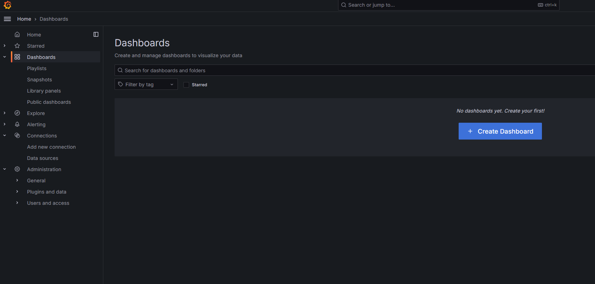
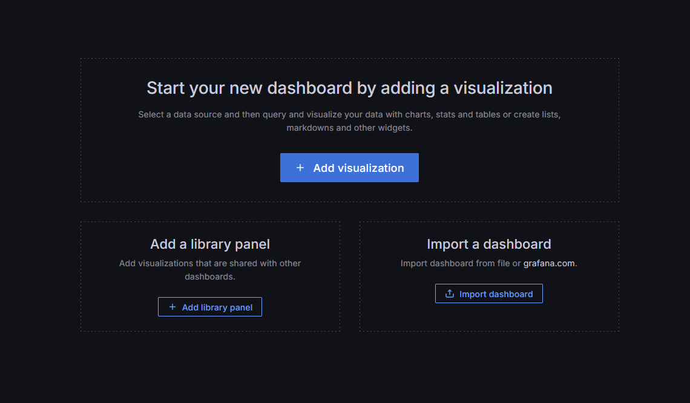
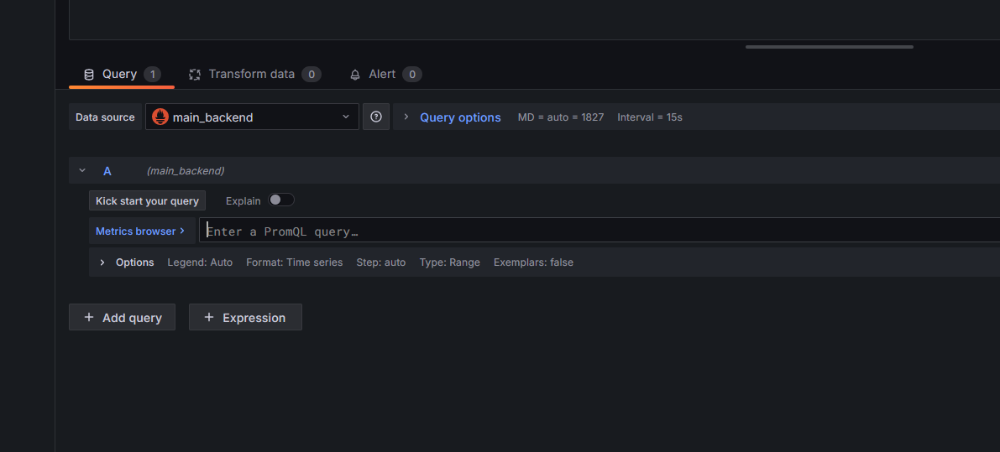
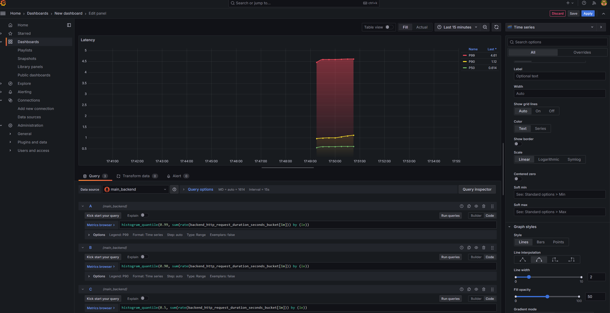
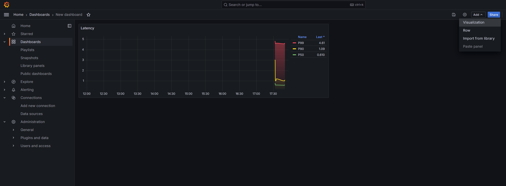

# Run apps
`docker compose -f .\metrics_prometheus_grafana\docker-compose.yml up`
### You must be in root folder, not inside 'metrics_prometheus_grafana' folder

# Configure Grafana panels (Histogram)

1. Click Dashboard -> Create Dashboard

2. Add visualization -> Select main_backend app

3. Add queries
    1. Enter PromQL query.
    2. Click 'Options' -> Legend -> Select from 'Auto' to 'Custom'. Type P99, P90 and P50 for corresponding query legend.

Enter following PromQL queries. Click 'Add query' to add another query.
- `histogram_quantile(0.99, sum(rate(backend_http_request_duration_seconds_bucket[1m])) by (le))`
- `histogram_quantile(0.90, sum(rate(backend_http_request_duration_seconds_bucket[1m])) by (le))`
- `histogram_quantile(0.50, sum(rate(backend_http_request_duration_seconds_bucket[1m])) by (le))`

4. Configure panel.
    1. Set title to 'Latency'
    2. Configure 'Legend':
        1. Select 'Mode' -> 'Table'.
        2. Select 'Placement' -> 'Right'.
        3. Select 'Values' -> 'Last' dropdown value field.
    3. Configure 'Graph styles'.
        1. Select line interpolation -> 'Smoothed' (2nd value).
        2. Set 'Line width' -> '2'.
        3. Set 'Fill opacity' -> '50'
        4. Set 'Gradient mode' -> 'Opacity'
    4. Configure Override fields.
        1. Click 'Add override field' -> 'Fields with name'.
        2. Choose 'Fields with name' for P99, P90, P50.
        3. Click 'Add override property' -> Search for 'color'-> Select 'Standard options > Color scheme'.
        4. Click 'Classic palette' -> 'Single color'.
        5. Choose 'Red' color for P99, 'Yellow' color for P90, 'Green' color for P50.

# Load with [bombardier](https://github.com/codesenberg/bombardier):
`bombardier  -c 10000 -n 10000000 http://localhost:8081`

# Example result

# Configure Summary panel
1. Add new 'Visualization'.

2. For P99, P90, P50 enter following queries
- backend_http_summary_request_duration_seconds{quantile="0.99"}
- backend_http_summary_request_duration_seconds{quantile="0.9"}
- backend_http_summary_request_duration_seconds{quantile="0.5"}
3. Configure styles same way as 'Histogram' panel.